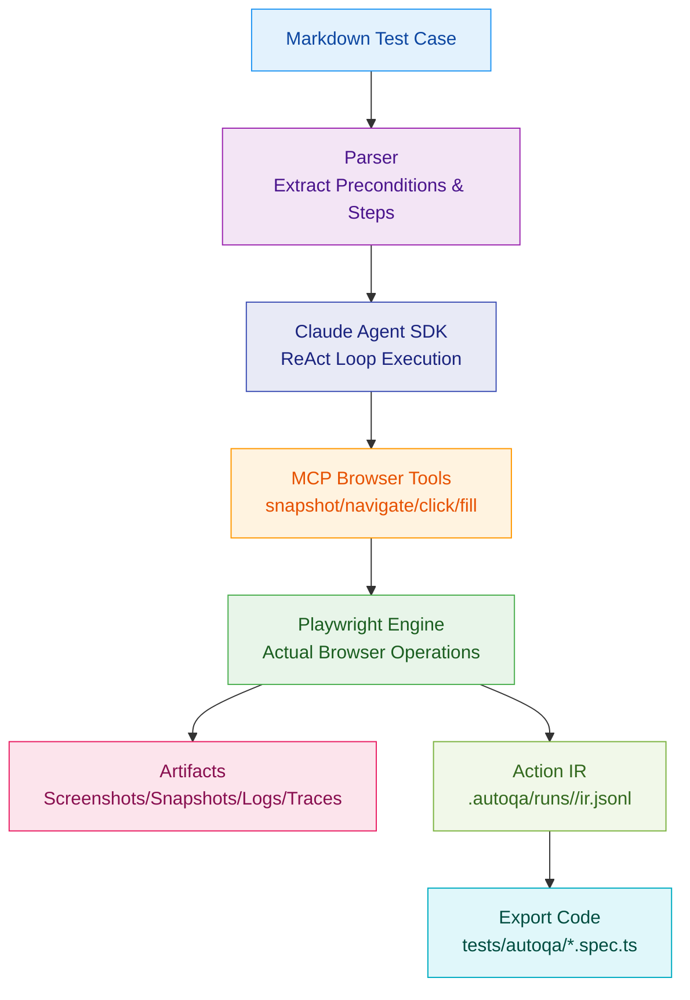
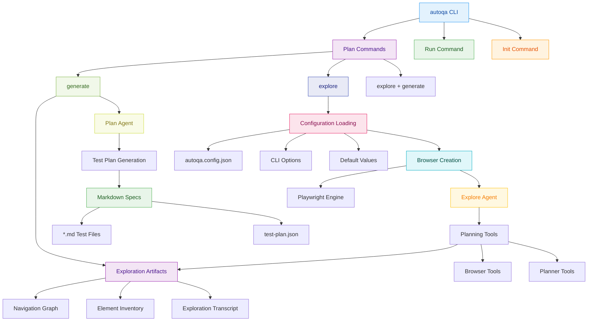
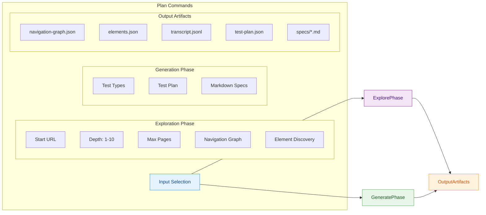

# AutoQA-Agent

[](https://github.com/terryso/autoqa-agent/stargazers)
[](https://www.npmjs.com/package/autoqa-agent)
[](https://www.npmjs.com/package/autoqa-agent)
[](https://github.com/terryso/autoqa-agent)
[](https://deepwiki.com/terryso/AutoQA-Agent)
[](https://d.doloo.top/uaaafvhl/sPQViF)

**[English](README.md) | [中文](README.zh.md)**

A "Docs-as-Tests" automated acceptance testing CLI tool based on Claude Agent SDK + Playwright.

> **Current Status**: Core capabilities of Epic 1-7 have been implemented: `autoqa init` initialization, `autoqa run` execution loop, assertions + self-healing guardrails, action IR recording with automatic export to `@playwright/test` cases, intelligent web application exploration (`autoqa plan-explore`), automated test plan generation (`autoqa plan-generate`), and comprehensive configuration support with enhanced CLI.

## 📖 Table of Contents

- [Overview](#overview)
- [Quick Start](#quick-start)
- [How It Works](#how-it-works)
  - [Architecture Overview](#architecture-overview)
  - [Plan Command Structure](#plan-command-structure)
- [AutoQA Agent vs Playwright Codegen](#-autoqa-agent-vs-playwright-codegen)
- [Implemented Features](#implemented-features)
- [Usage Guide](#usage-guide)
- [Configuration](#configuration)
- [Usage Examples](#usage-examples)
- [Artifacts](#artifacts)
- [Development Guide](#development-guide)
- [Roadmap](#roadmap)
- [Contributing](#contributing)
- [License](#license)

## Overview

> **Built with BMAD-METHOD**: This project is developed using the [Breakthrough Method for Agile AI-Driven Development](https://github.com/bmad-code-org/BMAD-METHOD), featuring 21 specialized AI agents and structured workflows that scale from bug fixes to enterprise platforms.

AutoQA-Agent is an innovative automated testing tool that enables QA and product managers to write acceptance tests in natural language Markdown, which are directly converted into executable test flows.


For more detailed architecture boundaries and constraints, please refer to [`docs/architecture.md`](docs/architecture.md).

### Core Objectives

- **Eliminate Script Fragility**: Reduce test maintenance costs caused by minor UI changes through intelligent locator strategies
- **Docs as Tests**: Write test cases in Markdown, allowing non-technical personnel to participate in test writing
- **Lightweight Agent Architecture**: Rely on Claude Agent SDK to manage reasoning loops, focusing on optimizing browser tool quality

## Quick Start

### Prerequisites

- Node.js >= 20
- npm or yarn
- Claude Code authorized (recommended) or set `ANTHROPIC_API_KEY`

> **Note**: Since Agent SDK requires a Claude Code subscription account or API key which can be costly, you may consider using [GLM Coding Plan](https://www.bigmodel.cn/claude-code?ic=TVUZHTWCW9) (first month only ¥100, API call count basically unlimited) as an alternative.

### Installation

```bash
# Option 1: Install from NPM (Recommended)
npm install -g autoqa-agent

# Option 2: Install from Source
git clone https://github.com/terryso/AutoQA-Agent.git
cd AutoQA-Agent

# Install dependencies
npm install

# Build project
npm run build

# Global installation (optional)
npm link
```

### Initialize Project

```bash
# Initialize configuration
autoqa init

# This will create:
# - autoqa.config.json - Configuration file
# - specs/ - Test case directory
# - specs/login-example.md - Example Markdown case (created if not exists)
```

### Run Your First Test

```bash
# Run a single test (built-in example)
autoqa run specs/saucedemo-01-login.md --url https://www.saucedemo.com/

# Run all tests in directory
autoqa run specs/ --url https://www.saucedemo.com/

# Debug mode (show browser interface)
autoqa run specs/saucedemo-01-login.md --url https://www.saucedemo.com/ --debug
```

## How It Works



### Execution Flow

1. **Markdown Parsing**: Extract preconditions and test steps
2. **Agent Execution**: Claude Agent SDK manages "observe-think-act" loop
3. **Intelligent Locating**: Prioritize stable ref references, fallback to semantic descriptions on failure
4. **Assertions & Self-Healing**: Execute assertion tools for Verify/Assert steps; flow back error context for retry on failure, limited by guardrails
5. **Result Collection**: Automatically record screenshots, snapshots, traces, and structured logs
6. **Persistence & Export**: Record action IR, and automatically export `@playwright/test` cases to `tests/autoqa/` after spec success

### Architecture Overview



### Plan Command Structure



## AutoQA Agent vs Playwright Codegen

AutoQA Agent represents the next evolution in automated testing, going beyond traditional code generation tools like Playwright's codegen:

| Feature | Playwright Codegen | AutoQA Agent | Assessment |
|---------|------------------|-------------|-----------|
| **Selector Priority** | 5-layer priority strategy | 7-layer priority strategy | 🏆 AutoQA more comprehensive |
| **AI Integration** | Basic AI assistance | Claude Agent SDK | 🏆 AutoQA more advanced |
| **Event Capture** | Browser injection listening | Agent active exploration | 🏆 AutoQA more intelligent |
| **Test Planning** | No planning features | AI-driven planning | 🏆 AutoQA unique feature |
| **Self-Healing** | Limited smart retry | Complete guardrail system | 🏆 AutoQA more robust |

### Key Advantages

- **Intelligent Test Planning**: Unlike Playwright's record-playback approach, AutoQA Agent actively explores and plans comprehensive test suites
- **Superior Selector Strategy**: 7-layer priority system with accessibility-first approach vs Playwright's 5-layer system
- **Complete AI Integration**: Built on Claude Agent SDK for true autonomous reasoning vs Playwright's basic AI assistance
- **Advanced Self-Healing**: Comprehensive guardrail system and intelligent retry mechanisms
- **Structured Exploration**: Automatic discovery of application structure and relationships

## Implemented Features

### CLI Commands

#### Test Planning & Exploration Commands

- **`autoqa plan`** - Full exploration and test case generation (default command)
  - Automatically explores the target web application
  - Generates comprehensive test plan and Markdown specifications
  - Supports both exploration and generation in a single run
  
- **`autoqa plan-explore`** - Web application exploration only
  - Explores target application and captures page structure
  - Generates navigation graph and element inventory
  - Creates exploration artifacts for later test generation
  
- **`autoqa plan-generate`** - Generate test cases from existing exploration
  - Uses previously generated exploration artifacts
  - Creates Markdown test specifications
  - Supports configurable test type generation

#### Test Execution Commands

- **`autoqa init`** - Initialize project configuration
- **`autoqa run <path> --url <baseUrl>`** - Execute test cases (`--url` is required)
- **`autoqa run --debug`** - Run in debug mode
- **`autoqa run --headless`** - Run in headless mode (default)

### Browser Tools

| Tool | Description | Parameters |
|------|-------------|------------|
| `snapshot` | Capture accessibility snapshot | - |
| `navigate` | Navigate to specified page | url |
| `click` | Click element | ref, targetDescription |
| `fill` | Fill input field | ref, targetDescription, text |
| `select_option` | Select dropdown option | ref, label |
| `scroll` | Scroll page | direction, amount |
| `wait` | Explicit wait | seconds |
| `assertTextPresent` | Assert page contains specified text with at least one visible match | text |
| `assertElementVisible` | Assert target element is visible (supports semantic description parsing) | targetDescription |

## Usage Guide

### Writing Test Cases

Test cases use Markdown format and need to include the following structure:

```markdown
# Test Case Title

## Preconditions

- Base URL: https://example.com
- Test account created
- Browser supports JavaScript

## Steps

1. Navigate to /login
2. Verify the login form is visible
3. Fill the username field with testuser
4. Fill the password field with password123
5. Click the "Login" button
6. Verify the user is redirected to dashboard
```

Note: In the current version, Base URL is provided by `autoqa run --url <baseUrl>`; the Base URL in `## Preconditions` is for readability only and does not participate in parsing.

### Assertion Statements

Steps starting with the following will be recognized as assertions:

- `Verify` / `Assert`

### Best Practices

1. **Keep Steps Independent**: Each step should be an independent operation
2. **Use Clear Descriptions**: Avoid vague operation descriptions
3. **Use Assertions Reasonably**: Add assertions at key verification points
4. **Manage Test Data**: Use Preconditions to declare required test data

## Configuration

### Configuration File Support

AutoQA Agent supports comprehensive configuration through `autoqa.config.json`. This file allows you to:

- Define default target URLs and authentication
- Configure exploration limits and guardrails
- Specify test types and inclusion/exclusion patterns
- Set browser and execution preferences

### Complete Configuration Schema

```json
{
  "schemaVersion": 1,
  "guardrails": {
    "maxToolCallsPerSpec": 200,
    "maxConsecutiveErrors": 8,
    "maxRetriesPerStep": 5
  },
  "exportDir": "tests/autoqa",
  "plan": {
    "baseUrl": "https://example.com",
    "maxDepth": 3,
    "maxPages": 50,
    "includePatterns": ["/dashboard", "/settings"],
    "excludePatterns": ["/admin", "/billing"],
    "testTypes": ["functional", "form", "navigation", "responsive", "boundary", "security"],
    "auth": {
      "loginUrl": "https://example.com/login",
      "username": "testuser@example.com",
      "password": "password123"
    },
    "guardrails": {
      "maxAgentTurnsPerRun": 1000,
      "maxSnapshotsPerRun": 500,
      "maxPagesPerRun": 100,
      "maxTokenPerRun": 5000000
    }
  }
}
```

### Configuration Options

#### Global Settings
- **`schemaVersion`**: Configuration file version (required)
- **`guardrails`**: Global execution guardrails for `run` command
- **`exportDir`**: Directory for exported test cases (default: "tests/autoqa")

#### Plan Configuration (`plan`)
- **`baseUrl`**: Default target URL for exploration
- **`maxDepth`**: Maximum exploration depth (1-10, default: 3)
- **`maxPages`**: Maximum pages to visit (default: 50)
- **`includePatterns`**: URL patterns to include in exploration
- **`excludePatterns`**: URL patterns to exclude from exploration
- **`testTypes`**: Test types to generate:
  - `functional`: Core functionality tests
  - `form`: Form submission and validation tests
  - `navigation`: Navigation and routing tests
  - `responsive`: Responsive design tests
  - `boundary`: Edge case and error boundary tests
  - `security`: Basic security tests

#### Authentication (`plan.auth`)
- **`loginUrl`**: Login page URL (if different from target)
- **`username`**: Login username (or use `usernameVar` for environment variable)
- **`password`**: Login password (or use `passwordVar` for environment variable)
- **`usernameVar`**: Environment variable name for username
- **`passwordVar`**: Environment variable name for password

#### Plan Guardrails (`plan.guardrails`)
- **`maxAgentTurnsPerRun`**: Maximum agent tool calls per exploration (default: 1000)
- **`maxSnapshotsPerRun`**: Maximum snapshots captured (default: 500)
- **`maxPagesPerRun`**: Maximum pages explored (default: 100)
- **`maxTokenPerRun`**: Maximum tokens consumed (default: 5,000,000)

### CLI Override Priority

CLI parameters take precedence over configuration file settings:

```bash
# Configuration file values are overridden by CLI options
autoqa plan --url https://override.com --depth 5 --max-pages 20
```

Configuration loading priority:
1. CLI options (highest)
2. `autoqa.config.json` file
3. Built-in defaults (lowest)

## Usage Examples

### Example 1: Basic Web Application Exploration

```bash
# Quick exploration of a public website
autoqa plan-explore --url https://example.com --depth 2 --max-pages 10

# Output:
# Exploration completed for runId: abc123...
# Pages visited: 8
# Max depth reached: 2
# Results written to: .autoqa/runs/abc123.../plan-explore/
```

### Example 2: Full Test Planning with Authentication

```bash
# Create autoqa.config.json with authentication
cat > autoqa.config.json << 'EOF'
{
  "schemaVersion": 1,
  "plan": {
    "baseUrl": "https://app.example.com",
    "maxDepth": 3,
    "auth": {
      "loginUrl": "https://app.example.com/login",
      "username": "test@example.com",
      "password": "password123"
    },
    "testTypes": ["functional", "form", "navigation"],
    "guardrails": {
      "maxAgentTurnsPerRun": 50,
      "maxPagesPerRun": 20
    }
  }
}
EOF

# Run full exploration and test generation
autoqa plan

# Output:
# Starting exploration...
# Exploration completed
# Pages visited: 15
# Exploration results: .autoqa/runs/abc123.../plan-explore/
# 
# Generating test cases...
# Test plan generated
# Test cases created: 12
# Test specs: .autoqa/runs/abc123.../plan/specs/
```

### Example 3: Targeted Testing with Patterns

```bash
# Focus on specific application areas
autoqa plan \
  --url https://app.example.com \
  --include-patterns "/dashboard,/settings,/profile" \
  --exclude-patterns "/admin,/billing" \
  --test-types "functional,form,navigation" \
  --depth 4 \
  --max-pages 30

# Results in focused exploration of user-facing areas only
```

### Example 4: CI/CD Integration

```bash
# Headless exploration for automated pipelines
autoqa plan \
  --config ./ci/autoqa.config.json \
  --headless \
  --depth 2 \
  --max-pages 15 \
  --test-types "functional,navigation"

# Exit codes:
# 0: Success
# 1: Runtime error  
# 2: Configuration error
# 10: Guardrail violation
```

### Example 5: Two-Phase Workflow

```bash
# Phase 1: Exploration only (can be done once per version)
autoqa plan-explore \
  --url https://app.example.com \
  --depth 4 \
  --max-pages 50 \
  --login-url https://app.example.com/login \
  --username ci@example.com \
  --password $CI_PASSWORD

# Phase 2: Generate different test types from same exploration
autoqa plan-generate \
  --run-id abc123... \
  --test-types "functional,form"

# Later: Generate additional test types without re-exploring
autoqa plan-generate \
  --run-id abc123... \
  --test-types "security,boundary"
```

### Generated Test Structure

After running plan commands, you'll get:

```
.autoqa/runs/<runId>/
├── plan-explore/
│   ├── navigation-graph.json     # Site navigation structure
│   ├── elements.json            # Discovered interactive elements
│   └── transcript.jsonl         # Exploration log
├── plan/
│   ├── test-plan.json          # Structured test plan
│   └── specs/
│       ├── dashboard-login.md   # Generated test cases
│       ├── user-profile.md
│       └── settings-form.md
└── plan-summary.json           # Execution summary
```

### Example Generated Test Case

The generated Markdown test cases follow this format:

```markdown
# Dashboard Login Test

## Preconditions

- User is logged into the application
- Dashboard page is accessible

## Steps

1. Navigate to /dashboard
2. Verify the user profile section is visible
3. Click the settings navigation link
4. Verify the settings page loads successfully
5. Update the user name field with "Test User"
6. Click the save button
7. Verify the success notification appears
8. Navigate back to dashboard
9. Verify the updated name is displayed
```

## Artifacts

After execution completes, test artifacts and export results mainly include:

```
.autoqa/runs/2024-01-01T12-00-00/
├── run.log.jsonl    # Structured execution log
├── ir.jsonl         # Action IR (for exporting Playwright Test)
├── screenshots/     # Page screenshots (depends on AUTOQA_ARTIFACTS)
├── snapshots/       # Accessibility snapshots (depends on AUTOQA_ARTIFACTS)
└── traces/          # Playwright Traces (depends on AUTOQA_ARTIFACTS)
```

Additionally, successfully run specs will automatically export `@playwright/test` cases to:

```
tests/autoqa/*.spec.ts
```

## Development Guide

### Project Structure

```
src/
├── agent/           # Claude Agent SDK integration, guardrails
├── auth/            # Auth detection
├── browser/         # screenshot/snapshot
├── cli/             # CLI argument parsing and command routing
├── config/          # autoqa.config.json reading and validation
├── ir/              # Action IR, locator candidates and data structures for export dependencies
├── markdown/        # Markdown spec parsing
├── runner/          # spec lifecycle, trace/export orchestration
├── specs/           # spec discovery
└── tools/           # Playwright adapters + assertions
```

### Build and Test

```bash
# Development mode
npm run dev

# Run tests
npm test

# Build production version
npm run build
```

## Roadmap

### Completed (Epic)

- [x] Epic 1: Zero-config onboarding (project initialization)
- [x] Epic 2: Execution loop (from Markdown driving browser to complete flow)
- [x] Epic 3: Acceptance judgment and self-healing loop (assertions + failure retry + guardrails)
- [x] Epic 4: Sedimentation and export (action IR + automatic export Playwright Test)
- [x] Epic 5: Configurable exploration strategy (intelligent web application discovery)
- [x] Epic 6: Test plan generation (automated test case creation from exploration)
- [x] Epic 7: Integration with existing toolchain (configuration files, CLI enhancement)

### Backlog (Optional Directions)

- [ ] Enhanced test case generation with more sophisticated test types
- [ ] Visual testing and UI regression detection
- [ ] API testing integration alongside UI tests
- [ ] Test execution scheduling and parallel execution
- [ ] Advanced reporting and analytics dashboard
- [ ] Integration with popular CI/CD platforms
- [ ] Support for mobile and responsive testing patterns
- [ ] Performance testing capabilities
- [ ] Enrich export capabilities (more semantic step parsing and more complete assertion mapping)
- [ ] Add more example specs and end-to-end demo projects
- [ ] Continuous improvement of documentation and architecture diagrams

## Star History

[](https://www.star-history.com/#terryso/AutoQA-Agent&type=date&legend=top-left)

## Contributing

We welcome all forms of contributions!

### Submitting Issues

- Use Issue templates to report bugs or suggest features
- Provide detailed reproduction steps and environment information

### Submitting Pull Requests

1. Fork the project
2. Create feature branch: `git checkout -b feature/amazing-feature`
3. Commit changes: `git commit -m 'Add amazing feature'`
4. Push branch: `git push origin feature/amazing-feature`
5. Create Pull Request

### Development Guidelines

- Follow existing code style
- Add appropriate tests
- Update relevant documentation

## License

This project is licensed under the [MIT License](LICENSE).

## Acknowledgments

- [Claude Agent SDK](https://github.com/anthropics/claude-agent-sdk) - Agent framework
- [Playwright](https://playwright.dev/) - Browser automation
- [Mermaid](https://mermaid.js.org/) - Chart support

---

## FAQ

<details>
<summary>How to debug failed tests?</summary>

Use the `--debug` parameter to run tests and see the browser interface. Check `.autoqa/runs/<runId>/run.log.jsonl` for detailed execution logs.
</details>

<details>
<summary>Is CI/CD integration supported?</summary>

Yes, it can run in CI environments through the `--headless` parameter. Exit code conventions: 0=success, 1=test failure, 2=configuration error.
</details>

<details>
<summary>How to handle dynamic content?</summary>

The Agent will automatically retry failed operations. It's recommended to use the `wait` tool to wait for dynamic content to load.
</details>

---

For any questions, please submit an [Issue](https://github.com/terryso/AutoQA-Agent/issues) or join our discussion.