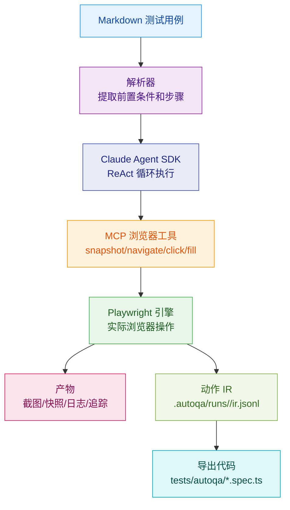
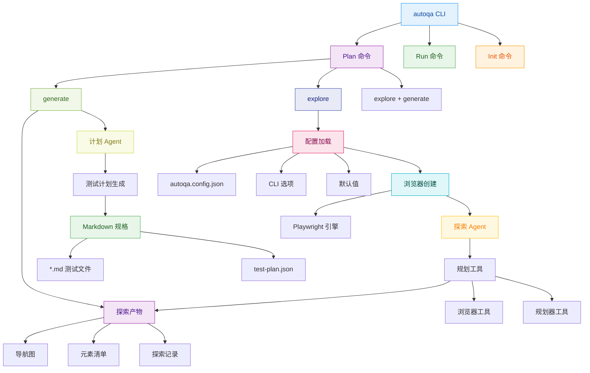
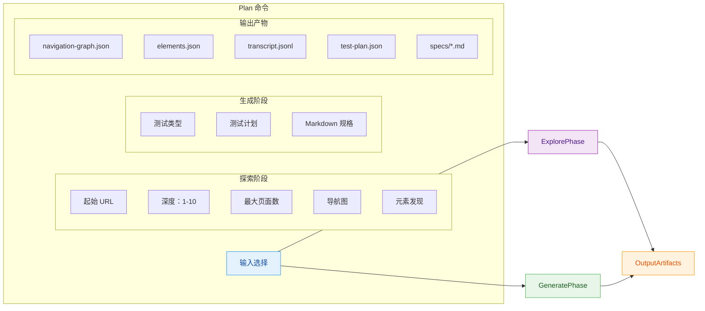

# AutoQA-Agent

[](https://github.com/terryso/autoqa-agent/stargazers)
[](https://www.npmjs.com/package/autoqa-agent)
[](https://www.npmjs.com/package/autoqa-agent)
[](https://github.com/terryso/autoqa-agent)
[](https://deepwiki.com/terryso/AutoQA-Agent)
[](https://d.doloo.top/uaaafvhl/sPQViF)

**[中文](README.zh.md) | [English](README.md)**

基于 Claude Agent SDK + Playwright 的"文档即测试"（Docs-as-Tests）自动化验收测试 CLI 工具。

> **当前状态**：Epic 1-7 的核心能力已实现：`autoqa init` 初始化、`autoqa run` 执行闭环、断言 + 自愈护栏、动作 IR 记录与自动导出 `@playwright/test` 用例、智能 Web 应用探索（`autoqa plan-explore`）、自动化测试计划生成（`autoqa plan-generate`），以及完善的配置支持和增强的 CLI。

## 📖 目录

- [概述](#概述)
- [快速开始](#快速开始)
- [工作原理](#工作原理)
  - [架构概览](#架构概览)
  - [Plan 命令结构](#plan-命令结构)
- [AutoQA Agent vs Playwright Codegen](#autoqa-agent-vs-playwright-codegen)
- [已实现功能](#已实现功能)
- [使用指南](#使用指南)
- [配置](#配置)
- [使用示例](#使用示例)
- [运行产物](#运行产物)
- [开发指南](#开发指南)
- [路线图](#路线图)
- [贡献指南](#贡献指南)
- [许可证](#许可证)

## 概述

> **采用 BMAD-METHOD 构建**：本项目采用 [突破性敏捷 AI 驱动开发方法](https://github.com/bmad-code-org/BMAD-METHOD) 开发，具有 21 个专业 AI 代理和结构化工作流，可从错误修复扩展到企业级平台。

AutoQA-Agent 是一个创新的自动化测试工具，让 QA 和产品经理能够用自然语言 Markdown 编写验收测试，直接转换为可执行的测试流程。


更详细的架构边界与约束说明请参考 [`docs/architecture.md`](docs/architecture.md)。

### 核心目标

- **消除脚本脆弱性**：通过智能定位策略，减少 UI 微小变动导致的测试维护成本
- **文档即测试**：用 Markdown 编写测试用例，让非技术人员也能参与测试编写
- **轻量级 Agent 架构**：依托 Claude Agent SDK 管理推理循环，专注优化浏览器工具质量

## 快速开始

### 环境要求

- Node.js >= 20
- npm 或 yarn
- Claude Code 已授权（推荐）或设置 `ANTHROPIC_API_KEY`

> **注意**：由于 Agent SDK 需要使用 Claude Code 的订阅帐号或者 API，费用比较高。您也可以考虑使用 [GLM 编程套餐](https://www.bigmodel.cn/claude-code?ic=TVUZHTWCW9)，第一个月只需要 100 元，API 调用次数基本用不完。

### 安装

```bash
# 选项 1：从 NPM 安装（推荐）
npm install -g autoqa-agent

# 选项 2：从源码安装
git clone https://github.com/terryso/AutoQA-Agent.git
cd AutoQA-Agent

# 安装依赖
npm install

# 构建项目
npm run build

# 全局安装（可选）
npm link
```

### 初始化项目

```bash
# 初始化配置
autoqa init

# 这将创建：
# - autoqa.config.json - 配置文件
# - specs/ - 测试用例目录
# - specs/login-example.md - 示例 Markdown 用例（如果不存在则创建）
```

### 运行第一个测试

```bash
# 运行单个测试（内置示例）
autoqa run specs/saucedemo-01-login.md --url https://www.saucedemo.com/

# 运行目录中的所有测试
autoqa run specs/ --url https://www.saucedemo.com/

# 调试模式（显示浏览器界面）
autoqa run specs/saucedemo-01-login.md --url https://www.saucedemo.com/ --debug
```

## 工作原理



### 执行流程

1. **Markdown 解析**：提取前置条件和测试步骤
2. **Agent 执行**：Claude Agent SDK 管理"观察-思考-行动"循环
3. **智能定位**：优先使用稳定的 ref 引用，失败时回退到语义描述
4. **断言与自愈**：为 Verify/Assert 步骤执行断言工具；失败时回传错误上下文进行重试，受护栏限制
5. **结果收集**：自动记录截图、快照、追踪和结构化日志
6. **持久化与导出**：记录动作 IR，测试成功后自动导出 `@playwright/test` 用例到 `tests/autoqa/`

### 架构概览



### Plan 命令结构



## AutoQA Agent vs Playwright Codegen

AutoQA Agent 代表了自动化测试的下一个演进，超越了传统的代码生成工具如 Playwright 的 codegen：

| 特性 | Playwright Codegen | AutoQA Agent | 评估 |
|------|------------------|-------------|------|
| **选择器优先级** | 5层优先级策略 | 7层优先级策略 | 🏆 AutoQA 更全面 |
| **AI 集成** | 基础 AI 辅助 | Claude Agent SDK | 🏆 AutoQA 更先进 |
| **事件捕获** | 浏览器注入监听 | Agent 主动探索 | 🏆 AutoQA 更智能 |
| **测试规划** | 无规划功能 | AI 驱动规划 | 🏆 AutoQA 独有功能 |
| **自愈能力** | 有限的智能重试 | 完整的 guardrail | 🏆 AutoQA 更健壮 |

### 关键优势

- **智能测试规划**：不同于 Playwright 的录制回放方法，AutoQA Agent 主动探索并规划全面的测试套件
- **卓越的选择器策略**：7层优先级系统，优先考虑可访问性，对比 Playwright 的 5层系统
- **完整的 AI 集成**：基于 Claude Agent SDK 的真正自主推理，对比 Playwright 的基础 AI 辅助
- **高级自愈能力**：全面的护栏系统和智能重试机制
- **结构化探索**：自动发现应用结构和关系

## 已实现功能

### CLI 命令

#### 测试规划与探索命令

- **`autoqa plan`** - 完整的探索和测试用例生成（默认命令）
  - 自动探索目标 Web 应用
  - 生成全面的测试计划和 Markdown 规格
  - 支持单次运行中的探索和生成

- **`autoqa plan-explore`** - 仅 Web 应用探索
  - 探索目标应用并捕获页面结构
  - 生成导航图和元素清单
  - 创建探索产物供后续测试生成使用

- **`autoqa plan-generate`** - 从已有探索生成测试用例
  - 使用之前生成的探索产物
  - 创建 Markdown 测试规格
  - 支持可配置的测试类型生成

#### 测试执行命令

- **`autoqa init`** - 初始化项目配置
- **`autoqa run <path> --url <baseUrl>`** - 执行测试用例（`--url` 是必需的）
- **`autoqa run --debug`** - 调试模式运行
- **`autoqa run --headless`** - 无头模式运行（默认）

### 浏览器工具

| 工具 | 描述 | 参数 |
|------|-------------|------------|
| `snapshot` | 捕获可访问性快照 | - |
| `navigate` | 导航到指定页面 | url |
| `click` | 点击元素 | ref, targetDescription |
| `fill` | 填充输入字段 | ref, targetDescription, text |
| `select_option` | 选择下拉选项 | ref, label |
| `scroll` | 滚动页面 | direction, amount |
| `wait` | 显式等待 | seconds |
| `assertTextPresent` | 断言页面包含指定文本且至少有一个可见匹配 | text |
| `assertElementVisible` | 断言目标元素可见（支持语义描述解析） | targetDescription |

## 使用指南

### 编写测试用例

测试用例使用 Markdown 格式，需要包含以下结构：

```markdown
# 测试用例标题

## 前置条件

- 基础 URL：https://example.com
- 测试账户已创建
- 浏览器支持 JavaScript

## 步骤

1. 导航到 /login
2. 验证登录表单可见
3. 使用 testuser 填充用户名字段
4. 使用 password123 填充密码字段
5. 点击"登录"按钮
6. 验证用户被重定向到仪表板
```

注意：当前版本中，基础 URL 由 `autoqa run --url <baseUrl>` 提供；`## 前置条件` 中的基础 URL 仅用于可读性，不参与解析。

### 断言语句

以以下内容开头的步骤将被识别为断言：

- `Verify` / `Assert`

### 最佳实践

1. **保持步骤独立**：每个步骤应该是独立的操作
2. **使用清晰的描述**：避免模糊的操作描述
3. **合理使用断言**：在关键验证点添加断言
4. **管理测试数据**：使用前置条件声明所需的测试数据

## 配置

### 配置文件支持

AutoQA Agent 通过 `autoqa.config.json` 支持全面的配置。此文件允许您：

- 定义默认的目标 URL 和认证
- 配置探索限制和护栏
- 指定测试类型和包含/排除模式
- 设置浏览器和执行偏好

### 完整配置架构

```json
{
  "schemaVersion": 1,
  "guardrails": {
    "maxToolCallsPerSpec": 200,
    "maxConsecutiveErrors": 8,
    "maxRetriesPerStep": 5
  },
  "exportDir": "tests/autoqa",
  "plan": {
    "baseUrl": "https://example.com",
    "maxDepth": 3,
    "maxPages": 50,
    "includePatterns": ["/dashboard", "/settings"],
    "excludePatterns": ["/admin", "/billing"],
    "testTypes": ["functional", "form", "navigation", "responsive", "boundary", "security"],
    "auth": {
      "loginUrl": "https://example.com/login",
      "username": "testuser@example.com",
      "password": "password123"
    },
    "guardrails": {
      "maxAgentTurnsPerRun": 1000,
      "maxSnapshotsPerRun": 500,
      "maxPagesPerRun": 100,
      "maxTokenPerRun": 5000000
    }
  }
}
```

### 配置选项

#### 全局设置
- **`schemaVersion`**：配置文件版本（必需）
- **`guardrails`**：`run` 命令的全局执行护栏
- **`exportDir`**：导出测试用例的目录（默认："tests/autoqa"）

#### Plan 配置（`plan`）
- **`baseUrl`**：探索的默认目标 URL
- **`maxDepth`**：最大探索深度（1-10，默认：3）
- **`maxPages`**：最大访问页面数（默认：50）
- **`includePatterns`**：探索中要包含的 URL 模式
- **`excludePatterns`**：探索中要排除的 URL 模式
- **`testTypes`**：要生成的测试类型：
  - `functional`：核心功能测试
  - `form`：表单提交和验证测试
  - `navigation`：导航和路由测试
  - `responsive`：响应式设计测试
  - `boundary`：边界情况和错误边界测试
  - `security`：基础安全测试

#### 认证（`plan.auth`）
- **`loginUrl`**：登录页面 URL（如果与目标不同）
- **`username`**：登录用户名（或使用 `usernameVar` 指定环境变量）
- **`password`**：登录密码（或使用 `passwordVar` 指定环境变量）
- **`usernameVar`**：用户名的环境变量名
- **`passwordVar`**：密码的环境变量名

#### Plan 护栏（`plan.guardrails`）
- **`maxAgentTurnsPerRun`**：每次探索的最大 Agent 工具调用次数（默认：1000）
- **`maxSnapshotsPerRun`**：最大捕获的快照数（默认：500）
- **`maxPagesPerRun`**：最大探索页面数（默认：100）
- **`maxTokenPerRun`**：最大消耗的令牌数（默认：5,000,000）

### CLI 覆盖优先级

CLI 参数优先于配置文件设置：

```bash
# 配置文件值被 CLI 选项覆盖
autoqa plan --url https://override.com --depth 5 --max-pages 20
```

配置加载优先级：
1. CLI 选项（最高）
2. `autoqa.config.json` 文件
3. 内置默认值（最低）

## 使用示例

### 示例 1：基础 Web 应用探索

```bash
# 快速探索公共网站
autoqa plan-explore --url https://example.com --depth 2 --max-pages 10

# 输出：
# Exploration completed for runId: abc123...
# Pages visited: 8
# Max depth reached: 2
# Results written to: .autoqa/runs/abc123.../plan-explore/
```

### 示例 2：带认证的完整测试规划

```bash
# 创建带认证的 autoqa.config.json
cat > autoqa.config.json << 'EOF'
{
  "schemaVersion": 1,
  "plan": {
    "baseUrl": "https://app.example.com",
    "maxDepth": 3,
    "auth": {
      "loginUrl": "https://app.example.com/login",
      "username": "test@example.com",
      "password": "password123"
    },
    "testTypes": ["functional", "form", "navigation"],
    "guardrails": {
      "maxAgentTurnsPerRun": 50,
      "maxPagesPerRun": 20
    }
  }
}
EOF

# 运行完整探索和测试生成
autoqa plan

# 输出：
# Starting exploration...
# Exploration completed
# Pages visited: 15
# Exploration results: .autoqa/runs/abc123.../plan-explore/
#
# Generating test cases...
# Test plan generated
# Test cases created: 12
# Test specs: .autoqa/runs/abc123.../plan/specs/
```

### 示例 3：带模式的定向测试

```bash
# 专注于特定应用区域
autoqa plan \
  --url https://app.example.com \
  --include-patterns "/dashboard,/settings,/profile" \
  --exclude-patterns "/admin,/billing" \
  --test-types "functional,form,navigation" \
  --depth 4 \
  --max-pages 30

# 结果只专注于面向用户的区域探索
```

### 示例 4：CI/CD 集成

```bash
# 自动化管道的无头探索
autoqa plan \
  --config ./ci/autoqa.config.json \
  --headless \
  --depth 2 \
  --max-pages 15 \
  --test-types "functional,navigation"

# 退出码：
# 0：成功
# 1：运行时错误
# 2：配置错误
# 10：护栏违规
```

### 示例 5：两阶段工作流

```bash
# 阶段 1：仅探索（每个版本可以执行一次）
autoqa plan-explore \
  --url https://app.example.com \
  --depth 4 \
  --max-pages 50 \
  --login-url https://app.example.com/login \
  --username ci@example.com \
  --password $CI_PASSWORD

# 阶段 2：从相同探索生成不同测试类型
autoqa plan-generate \
  --run-id abc123... \
  --test-types "functional,form"

# 稍后：无需重新探索生成其他测试类型
autoqa plan-generate \
  --run-id abc123... \
  --test-types "security,boundary"
```

### 生成的测试结构

运行 plan 命令后，您将得到：

```
.autoqa/runs/<runId>/
├── plan-explore/
│   ├── navigation-graph.json     # 站点导航结构
│   ├── elements.json            # 发现的交互元素
│   └── transcript.jsonl         # 探索记录
├── plan/
│   ├── test-plan.json          # 结构化测试计划
│   └── specs/
│       ├── dashboard-login.md   # 生成的测试用例
│       ├── user-profile.md
│       └── settings-form.md
└── plan-summary.json           # 执行摘要
```

### 生成的测试用例示例

生成的 Markdown 测试用例遵循此格式：

```markdown
# 仪表板登录测试

## 前置条件

- 用户已登录应用
- 仪表板页面可访问

## 步骤

1. 导航到 /dashboard
2. 验证用户资料部分可见
3. 点击设置导航链接
4. 验证设置页面加载成功
5. 使用"测试用户"更新用户名字段
6. 点击保存按钮
7. 验证成功通知出现
8. 返回仪表板
9. 验证更新的名称已显示
```

## 运行产物

执行完成后，测试产物和导出结果主要包括：

```
.autoqa/runs/2024-01-01T12-00-00/
├── run.log.jsonl    # 结构化执行日志
├── ir.jsonl         # 动作 IR（用于导出 Playwright Test）
├── screenshots/     # 页面截图（取决于 AUTOQA_ARTIFACTS）
├── snapshots/       # 可访问性快照（取决于 AUTOQA_ARTIFACTS）
└── traces/          # Playwright 追踪（取决于 AUTOQA_ARTIFACTS）
```

此外，成功运行的规格将自动导出 `@playwright/test` 用例到：

```
tests/autoqa/*.spec.ts
```

## 开发指南

### 项目结构

```
src/
├── agent/           # Claude Agent SDK 集成、护栏
├── auth/            # 认证检测
├── browser/         # 截图/快照
├── cli/             # CLI 参数解析和命令路由
├── config/          # autoqa.config.json 读取和验证
├── ir/              # 动作 IR、定位器候选和导出依赖的数据结构
├── markdown/        # Markdown 规格解析
├── runner/          # 规格生命周期、追踪/导出编排
├── specs/           # 规格发现
└── tools/           # Playwright 适配器 + 断言
```

### 构建和测试

```bash
# 开发模式
npm run dev

# 运行测试
npm test

# 构建生产版本
npm run build
```

## 路线图

### 已完成（Epic）

- [x] Epic 1：零配置上手（项目初始化）
- [x] Epic 2：执行闭环（从 Markdown 驱动浏览器到完整流程）
- [x] Epic 3：验收判断和自愈闭环（断言 + 失败重试 + 护栏）
- [x] Epic 4：沉淀和导出（动作 IR + 自动导出 Playwright Test）
- [x] Epic 5：可配置的探索策略（智能 Web 应用发现）
- [x] Epic 6：测试计划生成（从探索自动创建测试用例）
- [x] Epic 7：与现有工具链集成（配置文件、CLI 增强）

### 待办（可选方向）

- [ ] 增强测试用例生成，支持更复杂的测试类型
- [ ] 视觉测试和 UI 回归检测
- [ ] 与 UI 测试一起的 API 测试集成
- [ ] 测试执行调度和并行执行
- [ ] 高级报告和分析仪表板
- [ ] 与热门 CI/CD 平台集成
- [ ] 支持移动端和响应式测试模式
- [ ] 性能测试能力
- [ ] 丰富导出功能（更语义化的步骤解析和更完整的断言映射）
- [ ] 添加更多示例规格和端到端演示项目
- [ ] 持续改进文档和架构图

## Star History

[](https://www.star-history.com/#terryso/AutoQA-Agent&type=date&legend=top-left)

## 贡献指南

我们欢迎所有形式的贡献！

### 提交 Issues

- 使用 Issue 模板报告错误或建议功能
- 提供详细的复现步骤和环境信息

### 提交 Pull Requests

1. Fork 项目
2. 创建功能分支：`git checkout -b feature/amazing-feature`
3. 提交更改：`git commit -m 'Add amazing feature'`
4. 推送分支：`git push origin feature/amazing-feature`
5. 创建 Pull Request

### 开发指南

- 遵循现有代码风格
- 添加适当的测试
- 更新相关文档

## 许可证

本项目基于 [MIT 许可证](LICENSE) 授权。

## 致谢

- [Claude Agent SDK](https://github.com/anthropics/claude-agent-sdk) - Agent 框架
- [Playwright](https://playwright.dev/) - 浏览器自动化
- [Mermaid](https://mermaid.js.org/) - 图表支持

---

## FAQ

<details>
<summary>如何调试失败的测试？</summary>

使用 `--debug` 参数运行测试并查看浏览器界面。检查 `.autoqa/runs/<runId>/run.log.jsonl` 获取详细的执行日志。
</details>

<details>
<summary>是否支持 CI/CD 集成？</summary>

是的，可以通过 `--headless` 参数在 CI 环境中运行。退出码约定：0=成功，1=测试失败，2=配置错误。
</details>

<details>
<summary>如何处理动态内容？</summary>

Agent 会自动重试失败的操作。建议使用 `wait` 工具等待动态内容加载。
</details>

---

如有任何问题，请提交 [Issue](https://github.com/terryso/AutoQA-Agent/issues) 或加入我们的讨论。